**Nombres:** Katherin Juliana Moreno Carvajal, Mariana Salas Gutiérrez

# Microservicios con Kafka - Sistema de Órdenes

## 1. Descripción

Sistema distribuido basado en microservicios que implementa un flujo de órdenes usando Kafka (Confluent) y dos bases de datos (Comercial y Logística). 

Hay cinco microservicios: 

* **ordering-service:** Gestiona la creación de órdenes y publica el evento OrderCreated.
* **billing-service:** Procesa el pago y emite el evento PaymentProcessed.
* **inventory-service:** Valida disponibilidad y reserva el stock de productos.
* **shipping-service:** Genera el envío de la orden.
* **notification-service:** Envía notificaciones por correo electrónico al usuario.

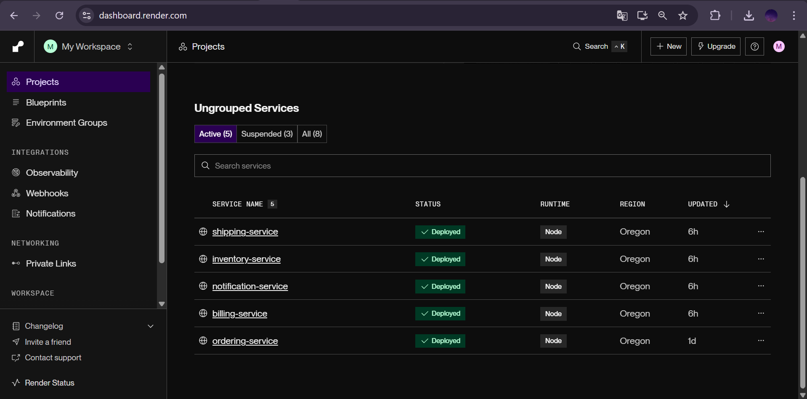

Los servicios se comunican mediante Kafka usando los siguientes tópicos:

* orders
* payments
* shipments

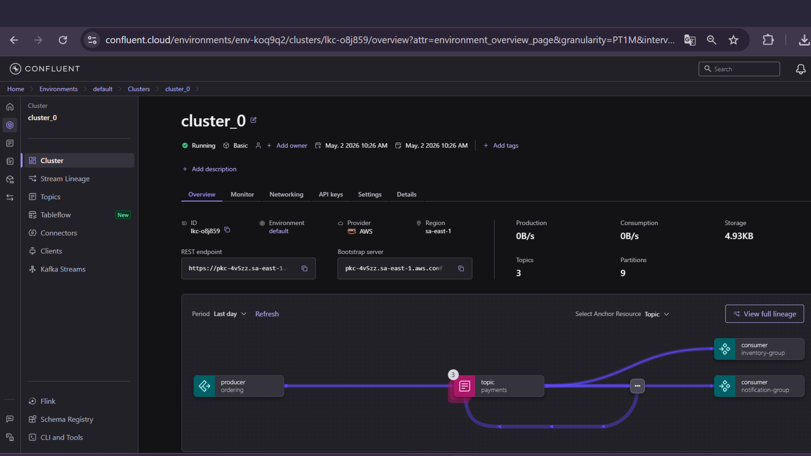

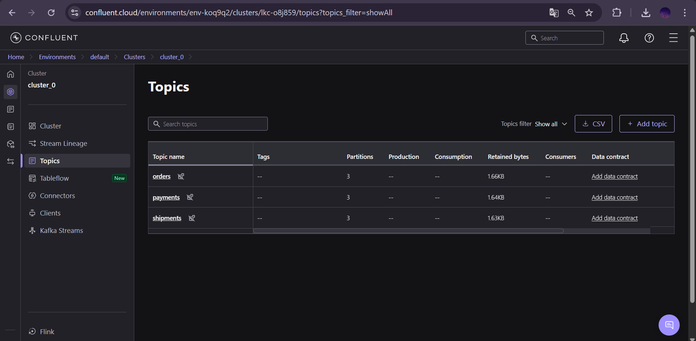

Acerca de las bases de datos, se tienen dos:

* **DB Comercial**
  * Usada por: Ordering y Billing
  * Contiene: órdenes y pagos
* **DB Logística**
  * Usada por: Inventory y Shipping
  * Contiene: productos y envíos
 
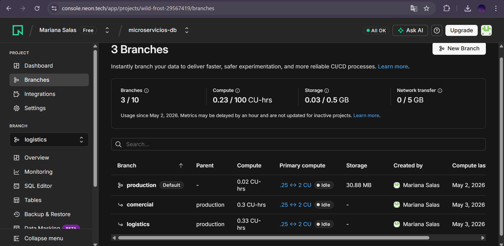

Para el manejo del envío de correos, se utiliza SenGrid.

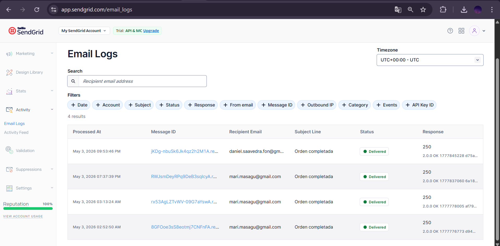

## 2. Clientes

A continuación, se listan los clientes existentes:

| ID    | Email                                                                 |
| ----- | --------------------------------------------------------------------- |
| user1 | daniel.saavedra.fon@gmail.com |
| user2 | mari.masagu@gmail.com               |

## 3. Productos disponibles

Los productos disponibles son los siguientes:

| ID     | Nombre      |
| ------ | ----------- |
| prod1  | Laptop      |
| prod2  | Mouse       |
| prod3  | Teclado     |
| prod4  | Monitor     |
| prod5  | Audifonos   |
| prod6  | Webcam      |
| prod7  | Disco SSD   |
| prod8  | Memoria RAM |
| prod9  | Silla Gamer |
| prod10 | Router WiFi |

## 4. ¿Cómo probar? (Postman)

### 4.1. Crear orden

**POST**

**Endpoint:** `/orders`

**URL completa:** `https://ordering-service-gbw3.onrender.com/orders`

**Body (JSON)**

```json
{
  "userId": "user1",
  "productId": "prod1"
}
```

## 4.2. Resultado esperado (logs)

```
OrderCreated: <orderId>
Billing procesa el pago: <orderId>
PaymentProcessed: <orderId>
Inventory valida y reserva stock: <productId>
Shipping genera el envío: <orderId>
Notification informa al usuario: <email>
```

**De no encontrar el correo, es importante tener en cuenta que se debe buscar en Spam**

# 5. Ejemplos

## 5.1. Ejemplo usando el correo del profesor

## 5.1.1. Postman

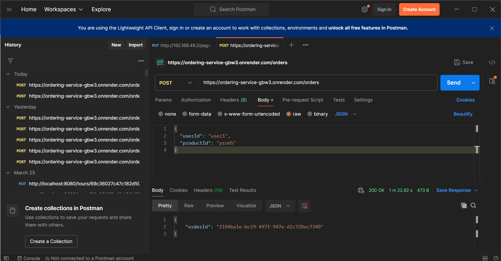

## 5.1.2. Logs

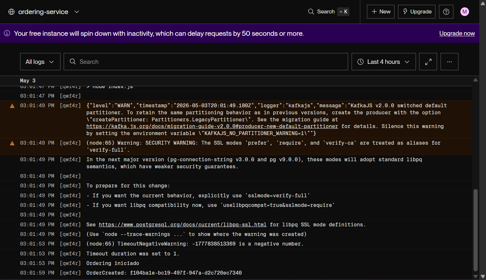

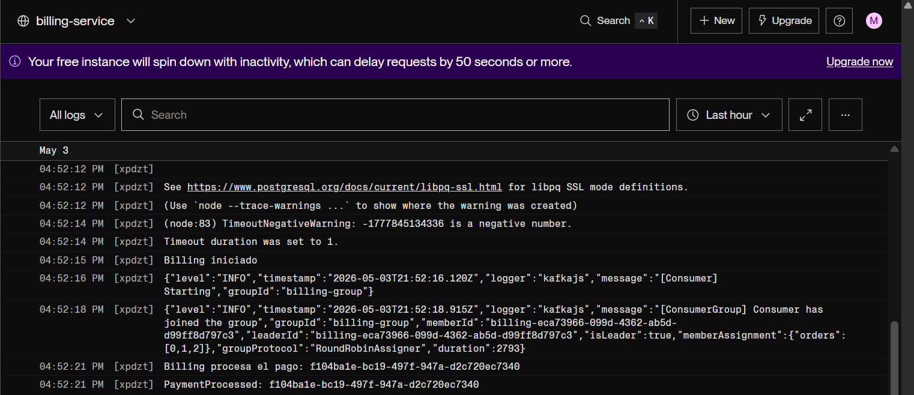

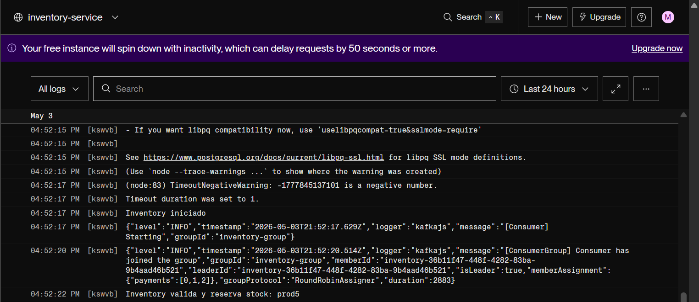

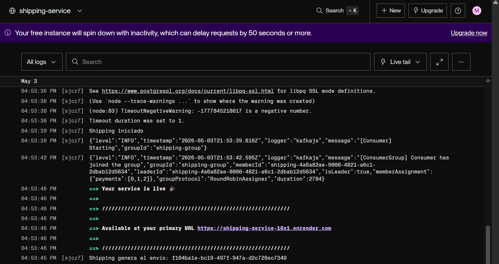

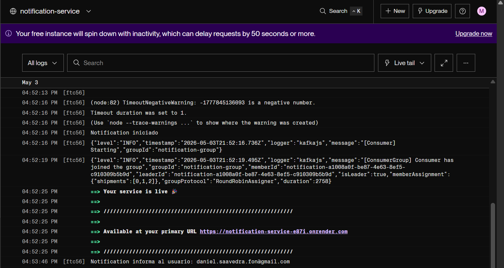

## 5.1.3. Correo

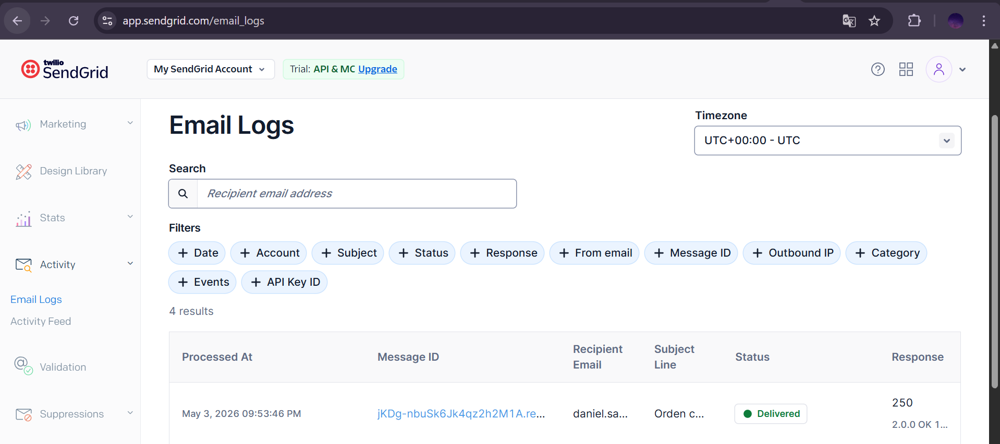

## 5.2. Ejemplo usando correo personal

## 5.2.1. Postman

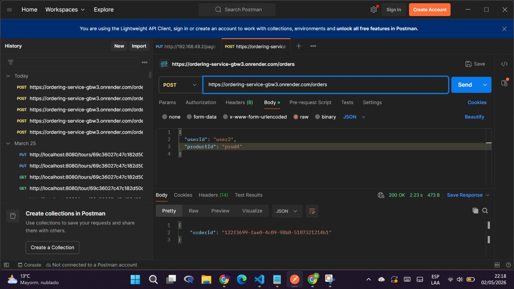

## 5.2.2. Logs

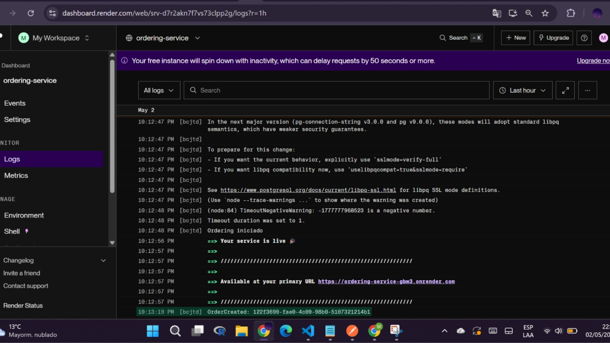

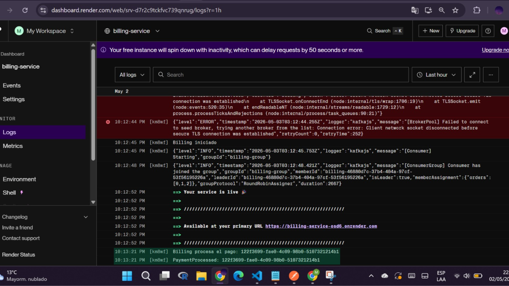

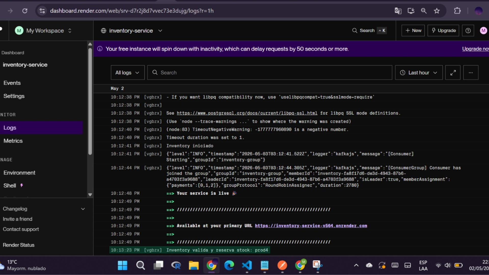

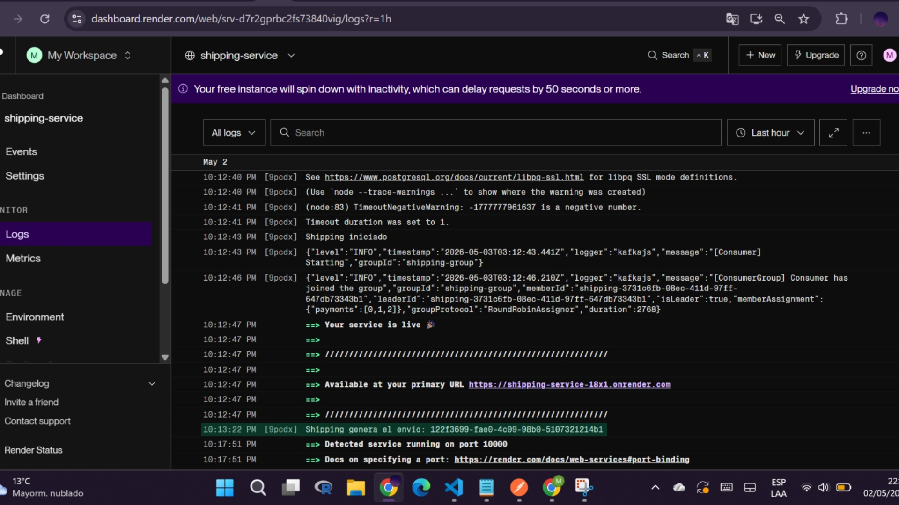

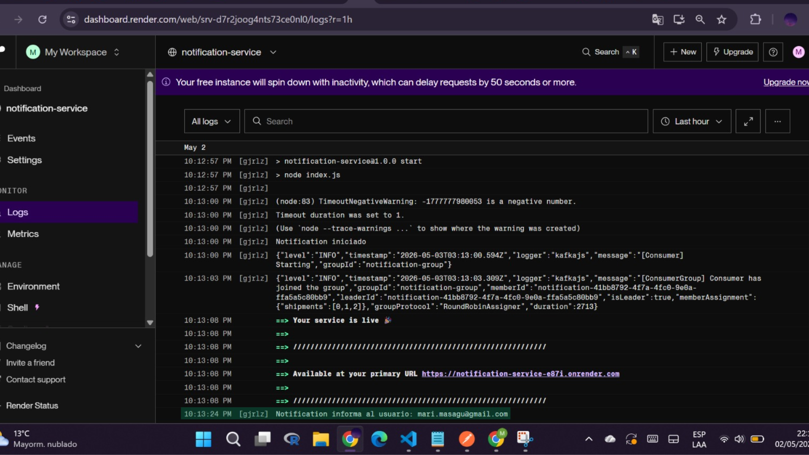

## 5.2.3. Correo

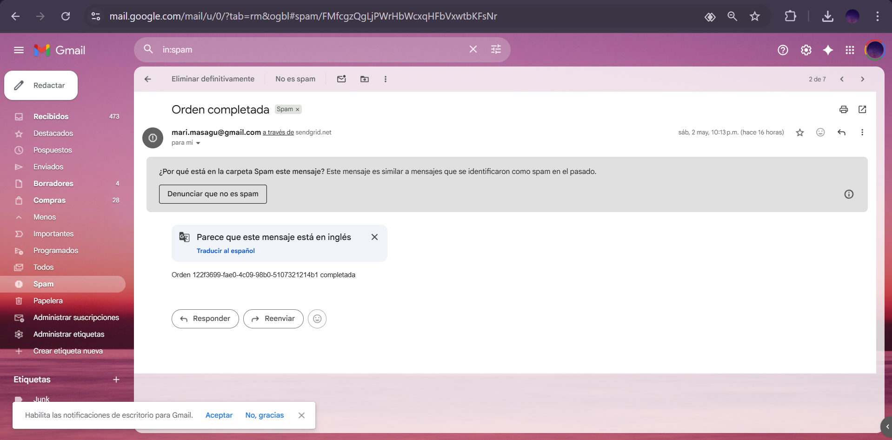

# 6. Tecnologías usadas

* Node.js
* Kafka (Confluent Cloud)
* PostgreSQL (Neon)
* Render (despliegue de los microservicios)
* SendGrid

# 7. Estructura del Proyecto

```
patrones-microservicios/
│
├── ordering-service/
│   ├── index.js
│   ├── db.js
│   ├── kafka.js
│   └── package.json
│
├── billing-service/
│   ├── index.js
│   ├── db.js
│   ├── kafka.js
│   └── package.json
│
├── inventory-service/
│   ├── index.js
│   ├── db.js
│   ├── kafka.js
│   └── package.json
│
├── shipping-service/
│   ├── index.js
│   ├── db.js
│   ├── kafka.js
│   └── package.json
│
├── notification-service/
│   ├── index.js
│   ├── db.js
│   ├── kafka.js
│   └── package.json
│
└── README.md
```
